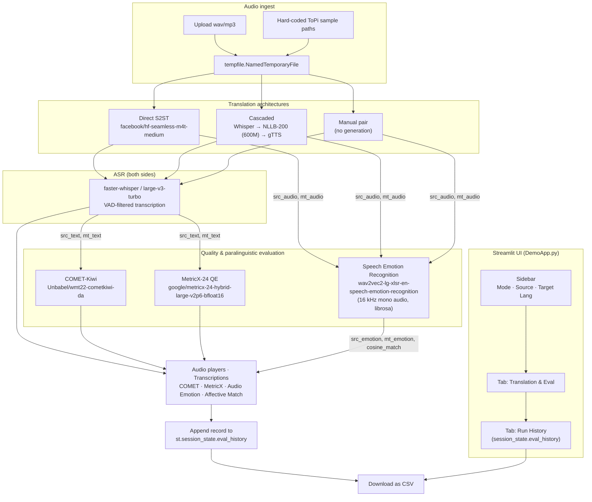

# `compnova-translationevals` — Architecture

This repository hosts a Streamlit demo that **translates spoken audio** between
seven languages and **evaluates the output** with reference-free quality and
paralinguistic metrics. The goal of the demo is to put two contrasting
translation architectures side-by-side and show what each one preserves,
mistranslates, or flattens about the source speech.

## What the app does

1. A user supplies a **source audio clip** (uploaded file or one of three
   hard-coded "Sample N" presets from the ToPi dataset).
2. They pick one of two **translation architectures**:
   - **Direct S2ST** — `facebook/hf-seamless-m4t-medium` consumes the source
     waveform and emits a translated waveform in one shot.
   - **Cascaded** — `faster-whisper` (`large-v3-turbo`) transcribes the
     source, `facebook/nllb-200-distilled-600M` translates the text,
     and `gTTS` synthesizes the target-language audio.
   - A third mode, **"Evaluate Existing Audio Pair"**, skips generation and
     lets the user upload a source/target pair directly.
3. For every run, the source and translated audio are transcribed with
   `faster-whisper`, then three text-based quality evaluators score the
   resulting text pair:
   - **COMET-Kiwi** (`Unbabel/wmt22-cometkiwi-da`) — 0–1, higher is better.
   - **MetricX-24 QE** (`google/metricx-24-hybrid-large-v2p6-bfloat16`) —
     0–25, lower is better.
   - **Speech Emotion Recognition (SER)** is then run **directly on the
     raw audio waveforms** of both source and target via the
     `ehcalabres/wav2vec2-lg-xlsr-en-speech-emotion-recognition` audio
     classifier. The pipeline resamples each clip to 16 kHz mono with
     `librosa.load` and feeds the numpy array straight to the
     `transformers` audio-classification pipeline. Outputs are sorted
     over the canonical 8-class label set
     (`angry`, `calm`, `disgust`, `fearful`, `happy`, `neutral`, `sad`,
     `surprised`), and an **Affective Match** score is computed as the
     cosine similarity between the two probability vectors over that
     label space. This replaces the legacy text-based
     `tabularisai/multilingual-sentiment-analysis` and
     `tabularisai/multilingual-emotion-classification` RoBERTa models —
     the SER model evaluates paralinguistic tone from the actual speech
     signal, independent of transcription quality or target-language
     tokenizer compatibility.
4. Audio players, transcriptions, quality scores, source/target audio
   emotion labels, and the affective match % are shown side-by-side.
   Each run is appended to a session-state history and can be exported
   as CSV.

## Repository layout

| Path | Role |
| --- | --- |
| `DemoApp.py` | The Streamlit app — page config, model loaders, processing functions, sidebar, and two tabs. The entrypoint referenced by the HF Spaces frontmatter (`app_file: app.py` is the historical naming; the actual file is `DemoApp.py`). |
| `SoftwareDemo1.ipynb` | Narrative walk-through of the same building blocks (Whisper transcription, COMET, MetricX). Useful as documentation; not run by the app. |
| `TestOutputs.ipynb` | Worked examples that drive the same functions over the [ToPi](https://www.nigelward.com/topi-full-data.zip) corpus and assemble a small evaluation table. |
| `test_audio_emotion.py` | Smoke test for the new `do_audio_emotion` SER helper — loads the wav2vec2-XLSR pipeline and runs it against the paired DRAL files in `data/dral/`. |
| `requirements.txt` | Python packages. Note `git+https://github.com/google-research/metricx.git` — MetricX is pulled straight from Google's research repo. |
| `packages.txt` | `ffmpeg` — required system dependency for audio decoding on Hugging Face Spaces / Streamlit Cloud. |
| `example_secrets.toml` | Template showing where to put `HF_TOKEN` for gated model downloads. The real token must be supplied via `HF_TOKEN` env var or `st.secrets["HF_TOKEN"]`; this file should only contain a placeholder. |
| `LICENSE` | Repository license. |
| `Final Translation Pitch Deck.pptx` | Pitch artifact; not consumed by the app. |
| `README.md` | Hugging Face Spaces frontmatter pointing at the app, plus a short pointer back to the explanatory notebooks. |

## Component map



## End-to-end data flow

```
            ┌──────────────────────────────────────────────────────────┐
            │                       Streamlit                          │
            │                                                          │
source ───► │  Sidebar  ──►  Mode & Architecture picker                │
            │      │                                                 │
            │      ▼                                                 │
            │  Translate  ──►  Direct S2ST            (SeamlessM4T) ──┼──► translated.wav
            │      │        ──►  Cascaded pipeline     (Whisper →     │
            │      │              NLLB-200 → gTTS) ──┼──► translated.mp3
            │      │                                 │                 │
            │      └────────►  Manual pair           │                 │
            │                                                          │
            │  Transcribe  ──►  faster-whisper (large-v3-turbo)        │
            │                  ├─► source_text                        │
            │                  └─► mt_text   (Whisper of translated)   │
            │                                                          │
            │  Evaluate    ──►  COMET-Kiwi  (src_text, mt_text)        │
            │                  ──►  MetricX-24  (src_text, mt_text)    │
            │                  ──►  SER         (src_audio, mt_audio)  │
            │                  ──►  Affective match = cosine(src, mt)  │
            │                                                          │
            │  Display + Append to st.session_state.eval_history       │
            │                              │                           │
            │                              ▼                           │
            │                       CSV download                       │
            └──────────────────────────────────────────────────────────┘
```

## Runtime characteristics

- **Caching.** Every model loader is wrapped in `@st.cache_resource`, so
  weights are downloaded and loaded once per Streamlit session and re-used
  across reruns. Drop-down changes do **not** reload them.
- **Device selection.** Each loader checks `torch.cuda.is_available()`. GPUs
  are used when present (`cuda`, `bfloat16`/`float16`); CPU + `int8`/`float32`
  is the fallback. The `packages.txt` (`ffmpeg`) and the pinned
  `transformers` in `requirements.txt` together keep the HF Spaces free tier
  reproducible.
- **Auth.** `HF_TOKEN` is read from `os.environ` first, then
  `st.secrets["HF_TOKEN"]`. If present, `huggingface_hub.login` runs at
  startup so gated models (COMET-Kiwi, MetricX-24, the XLM-R tokenizer)
  download successfully.
- **Side-effect handling.** Uploaded audio is written to a `tempfile` so
  `librosa.load`, `soundfile.write`, and `faster-whisper` see a real
  on-disk path. Generated audio (`SeamlessM4T` WAV or `gTTS` MP3) is also
  written to temp files and handed to `st.audio`.

## Translation architectures in detail

### Direct S2ST — SeamlessM4T

- Loaded once via `transformers.AutoProcessor` and
  `SeamlessM4TModel.from_pretrained("facebook/hf-seamless-m4t-medium")`.
- `generate_seamless_audio` calls `m4tmodel.generate(..., tgt_lang=…, generate_speech=True)`
  inside `torch.no_grad()`. The emitted waveform is dropped into a temp
  `.wav` via `soundfile.write` at the model's native sampling rate.
- Single network, single round-trip through the model.

### Cascaded — Whisper → NLLB-200 → gTTS

- **Whisper.** `faster-whisper` with `large-v3-turbo`, VAD filter on
  (`min_silence_duration_ms=500`), `beam_size=5`. Returns one joined string
  per file.
- **NLLB-200.** `facebook/nllb-200-distilled-600M` (the 600M variant was
  chosen to fit the HF Spaces free tier). BCP-47 codes are forced via
  `forced_bos_token_id=tokenizer.lang_code_to_id[target_nllb_code]`.
- **TTS.** `gTTS` saves an `.mp3`. Codes are mapped from the seven
  three-letter UI codes (`spa`, `fra`, `deu`, `cmn`, `ita`, `por`, `jpn`)
  to gTTS BCP-47 codes (`es`, `fr`, `de`, `zh-CN`, `it`, `pt`, `ja`).
- The cascaded mode re-transcribes the synthesized MP3 before scoring so
  the quality metrics operate on the **audio that the user will actually
  hear**, not on the intermediate text translation.
- A legacy `generate_hy_mt_translation` (Tencent HY-MT1.5-1.8B) remains in
  `DemoApp.py` as a commented-out alternative. The slow `openai-whisper`
  `large` model and the original Whisper path are likewise commented out.

### Manual pair

- Same metrics, identical evaluators — generation is skipped, so the user
  supplies both the source and translated audio files themselves.

## Evaluation layer

Three text evaluators consume the `(src_text, mt_text)` pair produced by
the faster-whisper transcription step. A fourth evaluator — the speech
emotion classifier — runs **directly on the audio waveforms** of the
source and translated clips, so it is independent of transcription
quality and target-language tokenizer coverage:

| Evaluator | Type | Input | Range | Direction |
| --- | --- | --- | --- | --- |
| COMET-Kiwi | Reference-free QE | `(src_text, mt_text)` | 0–1 | Higher is better |
| MetricX-24 hybrid-large-v2p6 (bfloat16) | Reference-free QE (`--qe`) | `(src_text, mt_text)` | 0–25 | Lower is better |
| Speech Emotion Recognition (`wav2vec2-lg-xlsr-en-speech-emotion-recognition`) | Audio classification | resampled 16 kHz mono waveform | 8-class softmax | — |
| Affective Match | Cosine similarity over the 8-class SER distributions | `(src_audio, mt_audio)` | -1…1 | Higher is better (1.0 = identical distributions) |

### Paralinguistic & affective analysis engine (SER)

The SER module replaces the previous text-based `tabularisai`
sentiment/emotion classifiers with an audio classifier applied to the raw
waveform. Behavioural contract:

- **Loader.** `@st.cache_resource`-wrapped `load_audio_emotion_pipeline`
  returns a single `transformers.pipeline("audio-classification",
  model="ehcalabres/wav2vec2-lg-xlsr-en-speech-emotion-recognition")`
  shared across all sessions.
- **Inference.** `do_audio_emotion(audio_path)` loads the file with
  `librosa.load(audio_path, sr=16000, mono=True)` to guarantee the 16 kHz
  mono waveform the wav2vec2 backbone expects, hands the numpy array
  straight to the pipeline, and returns the predictions sorted by score
  in descending order.
- **Label space.** The model surfaces eight emotions:
  `['angry', 'calm', 'disgust', 'fearful', 'happy', 'neutral', 'sad',
  'surprised']`. These are mirrored by the module-level `SER_LABELS`
  list, in the same fixed order on every invocation.
- **Match score.** `compute_affective_match_score(src_preds, mt_preds)`
  builds two aligned probability vectors over `SER_LABELS` (any label the
  pipeline omitted is filled with `0.0`) and returns their cosine
  similarity. An exact top-1 match with the rest of the distribution
  identical yields ~1.0; an empty distribution on either side yields 0.0.
- **Why audio, not text.** The legacy text classifiers relied on
  `faster-whisper` transcriptions, so they conflated emotion with
  transcription accuracy and tokenizer coverage in the target language.
  The wav2vec2 SER model evaluates paralinguistic tone directly from the
  acoustic signal — the same property the listener actually hears.

`MetricX-24` is the only evaluator that is **not** loaded into Python directly.
`do_metricx_eval` writes a JSONL record to `metricx/results/metricx_input.jsonl`,
shells out to `python -m metricx24.predict` via `subprocess.run`, and reads
the prediction back from `metricx_output.jsonl`. The current call site is
hard-coded to `--qe` (reference-free), so no human reference is needed.

## Configuration surface

- **HF_TOKEN** — `os.environ.get("HF_TOKEN")` then `st.secrets["HF_TOKEN"]`.
  Never commit a real token; `example_secrets.toml` is a template.
- **Language codes** — three UI codes (`spa`, `fra`, `deu`, `cmn`, `ita`,
  `por`, `jpn`) are mapped independently to each model's expected code
  (NLLB uses `Language_Script` like `spa_Latn`, gTTS uses BCP-47 like `es`).
- **Eval history** — lives in `st.session_state.eval_history` and is **not**
  persisted across browser sessions; the "Download Full History as CSV"
  button is the only way to keep a record.

## Running the app

```bash
pip install -r requirements.txt       # installs MetricX from a git URL
# FFmpeg is required on the host
export HF_TOKEN="<your-token>"        # or add to .streamlit/secrets.toml
streamlit run DemoApp.py
```

On Hugging Face Spaces the Streamlit SDK reads `app_file: app.py` from
`README.md`; the deployed `app.py` is expected to mirror `DemoApp.py`.

## Notebooks vs. the app

- `SoftwareDemo1.ipynb` re-implements the same functions as standalone
  cells, so each block (transcribe → COMET → MetricX) can be inspected
  in isolation. The legacy sentiment / text-emotion blocks have been
  retired in favour of the audio SER pipeline; new notebook cells for
  `do_audio_emotion` / `compute_affective_match_score` should be
  introduced here as the workflow evolves.
- `TestOutputs.ipynb` builds a `process_audio_pipeline` helper that
  iterates over audio pairs and produces a single `pandas.DataFrame`
  with blended accuracy scores, source/target audio emotions, and the
  affective match percentage. The previous multilingual
  sentiment / emotion outputs are superseded by the audio SER columns.
- `test_audio_emotion.py` is a CLI smoke test that imports
  `do_audio_emotion` and `compute_affective_match_score` from
  `DemoApp.py`, runs the SER pipeline against the paired DRAL clips in
  `data/dral/`, and asserts that all eight expected labels are
  surfaced. Use it as the canonical regression test for the SER
  pipeline on Windows.
